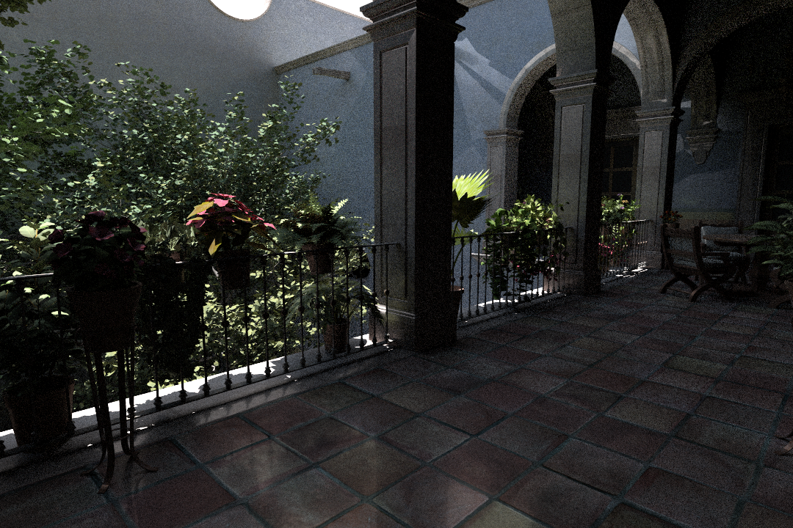
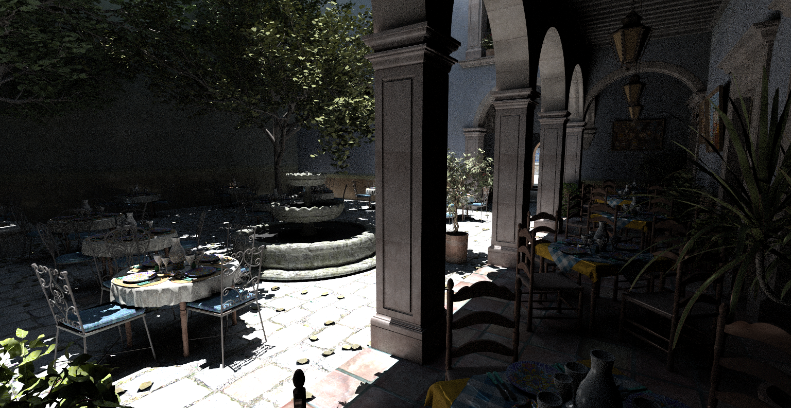
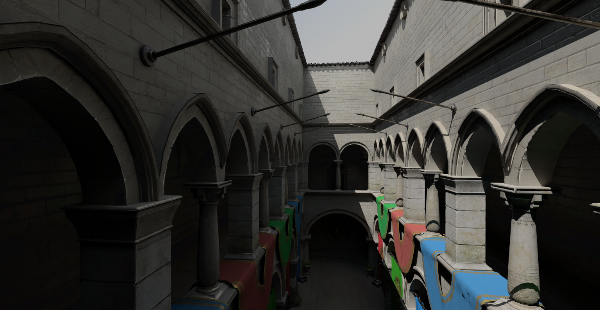

<br/><br/>

# Amber

Simple path tracer using Optix API. Early work in progress. 

## Screenshots
 
 
 
 

## Building
### Prerequisites
* CUDA
* Optix
* CMake

With the prerequisites installed, you just have to run the CMake:

``` sh
git clone https://github.com/mateeeeeee/Amber
cd Amber
mkdir build
cd build
cmake ..
```
Make sure the correct Optix installation directory is set in CMakeLists.txt. By default it's set to "C:/ProgramData/NVIDIA Corporation/OptiX SDK 8.0.0".


