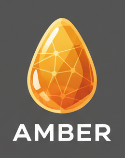
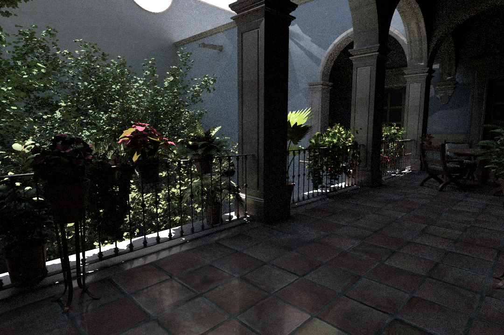
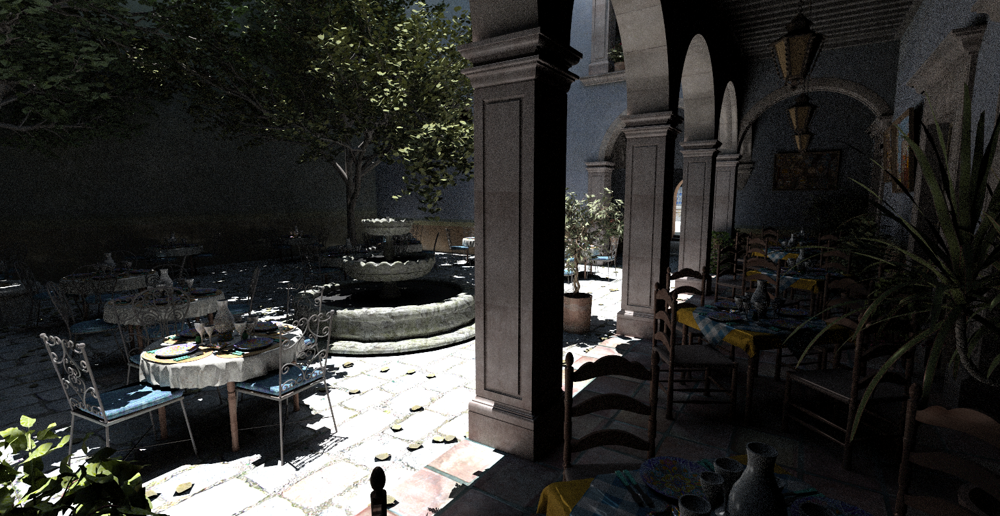
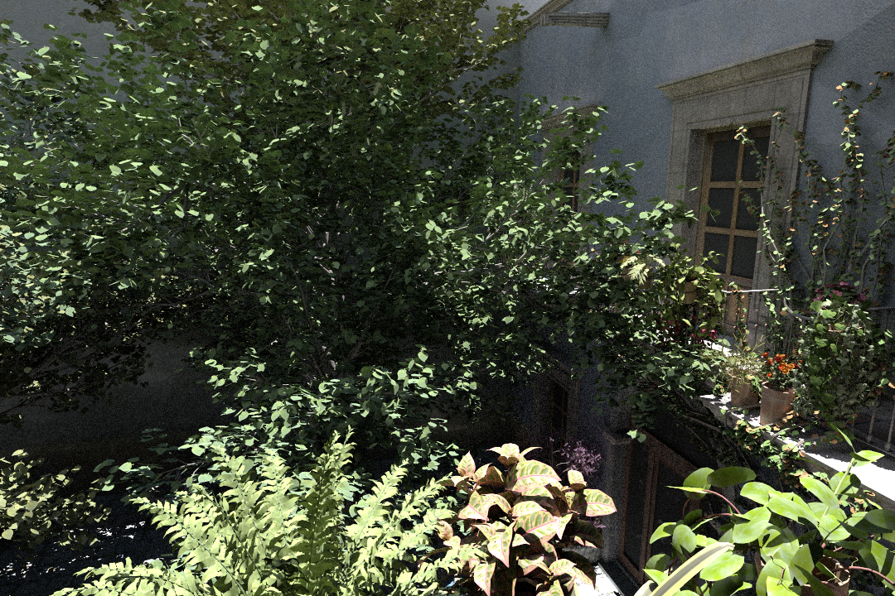
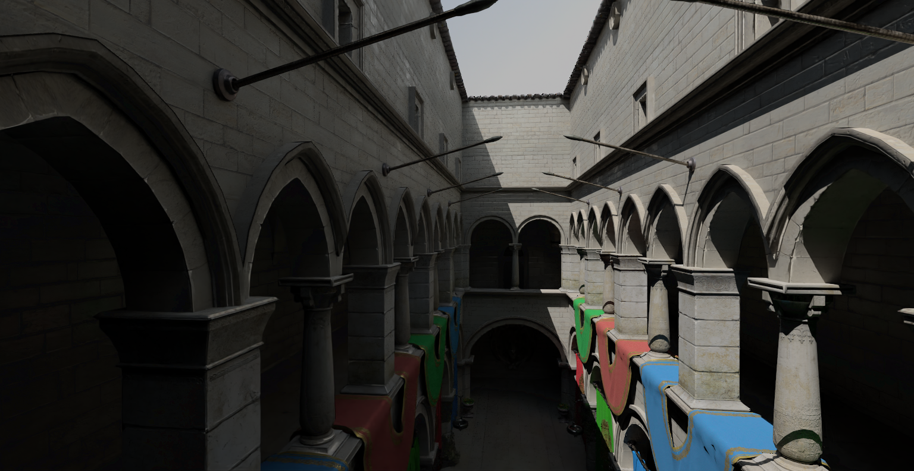
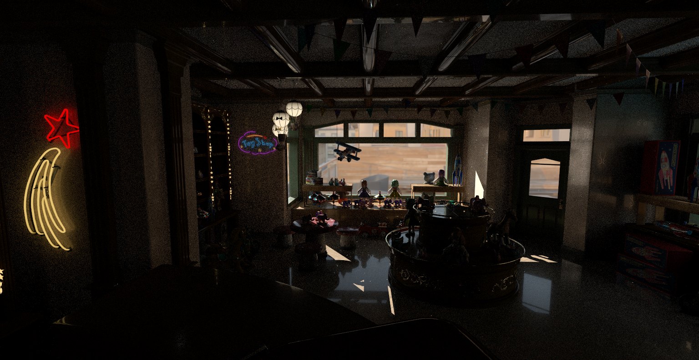

<br/><br/>

Path tracer with CPU, OptiX, and Metal backends.

## Features
- **CPU backend** (all platforms)
  - Custom BVH implementation: binned SAH, sweep SAH, median split, and PLOC bottom-up builders
  - BVH widening via greedy collapse
  - Two-level acceleration structure (BLAS/TLAS) with per-instance transforms
  - Lambert diffuse BRDF with direct lighting and shadow rays
  - HDR environment map sampling with Reinhard tonemapping
  - Diffuse and emissive texture support with bilinear sampling
  - BVH debug visualization: traversal step heatmap, primitive test heatmap, first-hit distance
  - BVH statistics (SAH cost, surface area, volume, depth, leaf prim distribution)
- **OptiX backend** (Windows/Linux, NVIDIA GPUs) with OptiX Denoiser
- **Metal backend** (macOS) with Metal ray tracing
- Unified GGX microfacet BSDF implementation across GPU backends
- Supported scene formats: OBJ, GLTF

## Screenshots






## Building

### Prerequisites

**Windows/Linux (OptiX backend, NVIDIA GPUs only)**
* NVIDIA GPU with RT cores (recommended) or Maxwell architecture or newer
* CUDA Toolkit
* OptiX SDK 8.0 or newer
* CMake 3.20 or newer

**macOS (Metal backend)**
* macOS 13.3 or newer
* Xcode Command Line Tools
* CMake 3.20 or newer

### Build Instructions

``` sh
git clone https://github.com/mateeeeeee/Amber
cd Amber
cmake -B build
cmake --build build
```

**OptiX SDK Path (Windows/Linux only)**

If OptiX is not installed in a standard location, specify it manually:
``` sh
cmake -B build -DOptiX_INSTALL_DIR=/path/to/optix
```
