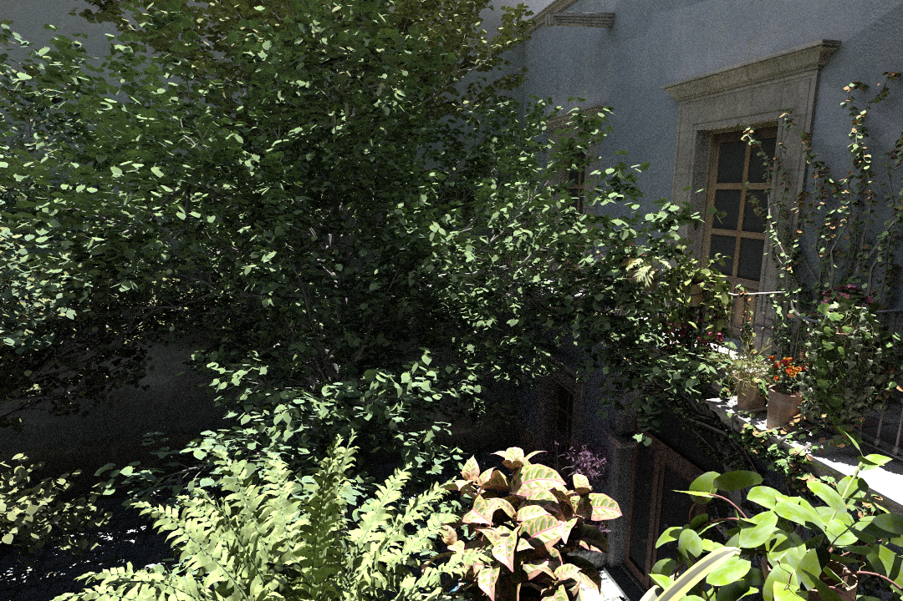

<br/><br/>

# Amber

Simple path tracer using Optix API. Early work in progress. 

Some of the current features include:
- Disney BRDF
- OptiX Denoiser
- Supported scene formats: OBJ, GLTF

## Screenshots
 
 
 
 
 

## Building
### Prerequisites
* CUDA Toolkit
* OptiX SDK 8.0 or newer
* CMake 3.20 or newer

### Build Instructions

With the prerequisites installed, run CMake:

``` sh
git clone https://github.com/mateeeeeee/Amber
cd Amber
mkdir build
cd build
cmake ..
```

CMake will automatically search for the OptiX SDK in standard installation directories:
- **Windows**: `C:/ProgramData/NVIDIA Corporation/OptiX SDK*`
- **Linux**: `/opt`, `/usr/local`, `$HOME`, `$HOME/Downloads`

If OptiX is installed in a custom location, you can specify it manually:
``` sh
cmake -DOptiX_INSTALL_DIR=/path/to/optix ..
```


